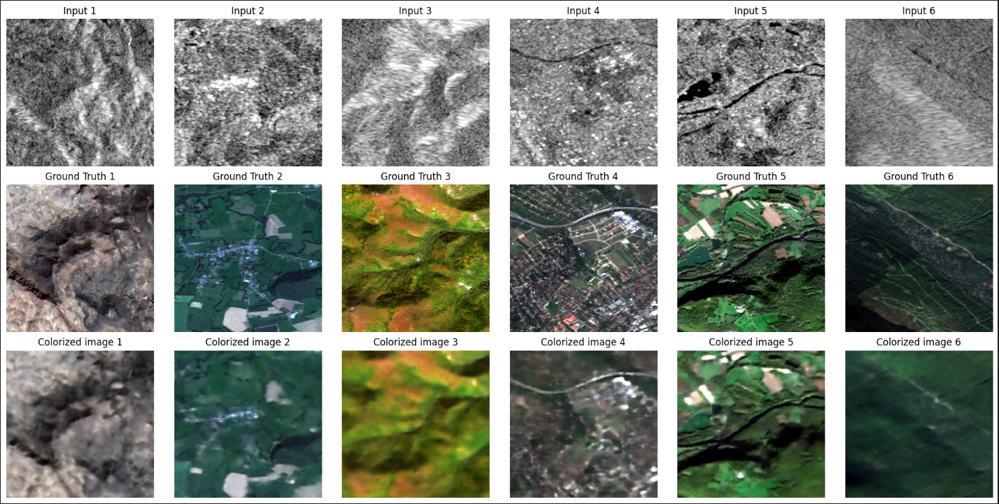

# SAR Image Colorization

# Overview

This is a Pix2Pix CGAN implementation for translating Synthetic Aperture Radar (SAR) images to optical images.


This repository contains a Jupyter Notebook (`sarpix2pixa.ipynb`) file that demonstrates the use of PyTorch for SAR image colorization . It is recommended to set up the environment using Conda or virtualenv to ensure the dependencies are correctly installed.

# Download the model
[pix2pix_gen_120.pth](https://huggingface.co/spaces/viishhnu/Remote-Sensing-SAR/resolve/main/models/pix2pix_gen_120.pth) -> Pix2Pix generator with transpose convolution, 120 epochs. **FID score is 498.012**


## Setup Instructions

Follow these steps to set up the environment and run the notebook:


### 1. Clone the repository

```bash
git clone https://github.com/Viishhnur/SARImageColorizationModel.git
cd SARColorizationPix2Pix
```
### 2. Download the Sentinal 1,2 - images dataset 
https://www.kaggle.com/datasets/requiemonk/sentinel12-image-pairs-segregated-by-terrain
After downloading move to the same directory where you are having the .ipynb file

### 3. Create a Conda environment (optional but recommended)

If you are using Conda, create an environment with the necessary dependencies:

```bash
conda create -n sarConda python=3.10
conda activate sarConda
```

### 4.1 Install required dependencies(If using pip)

Install the required Python packages using `requirements.txt`:

```bash
pip install -r requirements.txt
```

Alternatively, you can manually install dependencies like PyTorch:

```bash
pip install torch
pip install torchvision
pip install numpy
pip install pandas
pip install matplotlib
pip install scikit-learn
```
### 4.2 Install pytorch 
Navigate to https://pytorch.org/get-started/locally/ 
check your operating system , cuda version , python version and install pytorch in conda environment 

### 5. Run the Jupyter notebook

Once the environment is set up, you can start Jupyter and run the notebook:

```bash
jupyter notebook
```

Then open the notebook and run the cells.

### 6. Comet_ml account creation

Set Up Logging For Experimentation¶

Comet ML provides a convenient API to log experiments in a way easy to follow. It is also free for individuals. There are also other choices, you can replace it with your choice of platform.


Login using your api key.

Do not hardcode you api key, use an configuration file or use secrets if you are using colabs or kaggle

## Notes

- If you're running into any issues with dependencies, try upgrading the packages using `pip install --upgrade <package-name>`.
- This repository requires **PyTorch**. Make sure your environment has the correct version installed (e.g., `torch==2.1.0`).